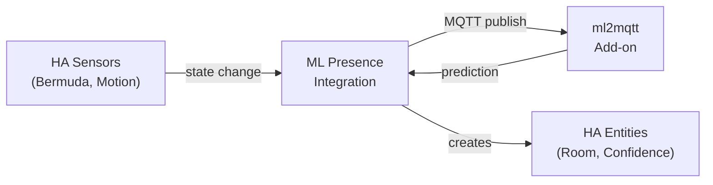

# ML Presence

A Home Assistant custom integration that bridges the [ml2mqtt](https://github.com/your-username/ml2mqtt) add-on with native HA entities for ML-based room presence detection.

## Features

- **Native HA Entities** — Predicted room, confidence, and training observation sensors
- **Sensor Bridge** — Automatically publishes configured sensor states to MQTT when trigger entities change
- **Single Source of Truth** — Configure tracked entities once in the integration; the add-on auto-discovers them
- **Training Card** — Bundled Lovelace card for labeling rooms and collecting training data
- **Multi-Model Support** — Run multiple models (e.g., per person/device)

## Requirements

- Home Assistant 2024.1.0+
- [ml2mqtt add-on](https://github.com/your-username/ml2mqtt) installed and running
- MQTT broker (e.g., Mosquitto)
- Bermuda BLE distance sensors (or similar positioning sensors)

## Installation

### HACS (Recommended)

1. Add this repository as a custom repository in HACS
2. Search for "ML Presence" and install
3. Restart Home Assistant
4. Go to **Settings → Devices & Services → Add Integration → ML Presence**

### Manual

1. Copy the `custom_components/ml_presence` folder to your HA `custom_components/` directory
2. Restart Home Assistant
3. Go to **Settings → Devices & Services → Add Integration → ML Presence**

## Configuration

### Adding a Model

1. Click **Add Integration** and enter the model name (must match a model in your ml2mqtt add-on)
2. The integration will verify connectivity with the add-on

### Configuring Sensors

1. Go to the integration entry and click **Configure**
2. Select **Trigger Entities** — sensors that cause a state publish when they change (e.g., Bermuda distance sensors, motion sensors)
3. Select **Context Entities** — additional sensors included in each publish but that don't trigger on their own (e.g., media player state, home/away status)

## Entities Created

For each model, the integration creates:

| Entity | Type | Description |
|--------|------|-------------|
| `sensor.ml_presence_<model>_predicted_room` | Sensor | Current room prediction |
| `sensor.ml_presence_<model>_confidence` | Sensor | Prediction confidence (%) |
| `sensor.ml_presence_<model>_training_observations` | Sensor | Total training data count |
| `binary_sensor.ml_presence_<model>_collecting` | Binary Sensor | Whether data collection is active |

## How It Works

1. **Trigger entity changes** → Integration publishes all configured entity states to MQTT
2. **ml2mqtt receives** the payload, runs the ML model, publishes prediction
3. **Integration polls** the add-on API for latest prediction and updates HA entities

## License

MIT
